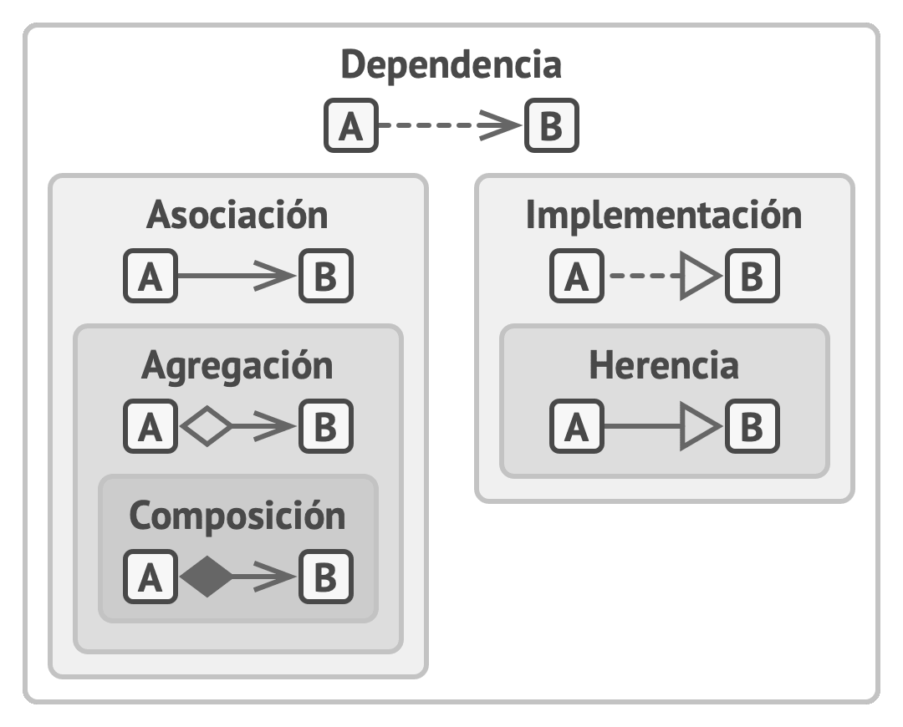

- **Dependencia**: La clase A puede verse afectada por cambios en la clase B.

- **Asociación**: El objeto A conoce el objeto B. La clase A depende de B.

- **Agregación**: El objeto A conoce el objeto B y consiste en B. La clase A depende de B.

- **Composición**: El objeto A conoce el objeto B, consiste en B y gestiona el ciclo vital de B. La clase A depende de B.

- **Implementación**: La clase A define métodos declarados en la interfaz B. Los objetos A pueden tratarse como B. La clase A depende de B.

- **Herencia**: La clase A hereda la interfaz y la implementación de la clase B, pero puede extenderla. El objeto A puede tratarse como B. La clase A depende de B.

